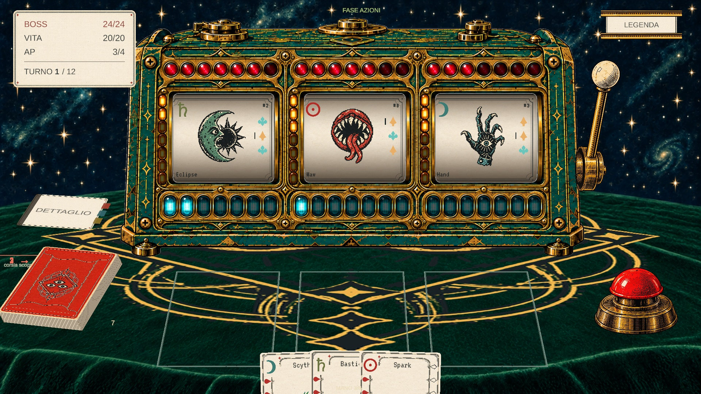

# Cassa integrata v4 — verifica del 12 settembre 2026

La cassa è stata ridisegnata interamente: ottone e smalto proseguono intorno agli
alloggiamenti delle luci. Ogni corsia ha sette lenti rosse per la vita, sette
capsule ambra sul montante verticale per l'attacco e sette tubi ciano sotto il
rullo per la difesa. Sono 63 luci dipinte nella cassa: lo shader cambia la
luminosità del vetro, senza aggiungere pannelli di lampadine sopra la grafica.
I totali maggiori di sette compaiono negli spazi misurati del manifest.

## Prova reale di Kilo

Prompt: **Monta i nuovi asset integrati della slot**.

Agente `auto`, alias `router/auto`; per il montaggio testuale il router ha usato
Qwen3.5 2B Q4_K_M locale, CPU, una istanza con contesto 16k. Kilo ha eseguito
`unity_art_bundle` quattro volte: inspect, install, verify, capture. Il ledger
del harness è passato a `complete`, senza stop e senza compattazioni. La CLI ha
terminato con codice zero. Cinque richieste al modello, **19.008 token totali
elaborati**, inclusi i contesti riletti; il primo prompt conteneva 3.115 token.
Il modello locale non ha dichiarato di aver esaminato visivamente la cattura.

Questa prova qualifica il montaggio di un bundle preparato con procedura locale,
non il modello 2B come programmatore generale né come autore autonomo degli asset.
Il supervisore ha preparato la grafica e l'installer, e dopo questa prova ha
corretto la lettura dei rettangoli del manifest e la trasparenza delle aperture.
La versione grafica finale è stata rimontata e verificata direttamente via MCP.

Prima della prova riuscita sono emersi tre difetti reali, conservati nei log
locali: confusione del 2B sui checkpoint manuali, memoria insufficiente con due
contesti GPU, e istruzioni ridotte solo in una copia dell'array del prompt.
Ora il harness gestisce i checkpoint del bundle, il monitor seleziona CPU 16k
con meno di 8 GB di commit libero e il plugin modifica l'array nativo in-place.

## Verifiche sulla versione finale

- 63 campioni dei valori, comprendenti 0, 1, 6, 7, 9 e diminuzioni; bonus, morte e Retro.
- 63 confronti GPU delle lenti accese/spente, renderizzati dalla Main Camera.
- 6 campioni di risonanza e ripristino della difesa.
- 12 controlli dei rettangoli reali contro le misure del manifest.
- 3 campioni sulle aperture: il bianco della sorgente non deve coprire i rulli.
- Shader senza errori; Console MCP senza errori restituiti; screenshot esaminato dal supervisore.

L'animazione temporizzata del rullo non è certificata: Unity in background resta
al primo frame. Le prove effettuate campionano stati e rendering reale; non
equivalgono a una partita completa. La cattura e la lettura della Console da sole
non garantiscono la correttezza della logica, per questo i campioni sono espliciti.

## Auto ibrido e dati riservati

Il flusso configurato è locale per le quattro operazioni di montaggio, poi online
gratuito con vista quando arriva l'immagine. La selezione online usa qualificazione
dei benchmark, capacità, contesto, cooldown e budget; i profili esplicitamente
locali non effettuano fallback online.

Sono autorizzati codice, asset, struttura e immagini del progetto. Il filtro
`privacy.py` controlla l'uscita, senza bloccare i normali file del progetto e senza
tagliare silenziosamente la cronologia. Blocca credenziali riconoscibili e testo
marcato riservato. Non è un rilevatore universale di dati personali o segreti
contenuti in immagini: tali contenuti devono restare fuori dal contesto online.

**Prova online ancora non eseguita:** la revisione automatica dell'ambiente ha
rifiutato la CLI ibrida chiedendo conferma specifica del payload verso `api.kilo.ai`,
anche dopo l'autorizzazione generale dell'utente. Non è un errore del router e
non è stato aggirato. I test locali verificano la scelta locale per il testo e
quella online per la cattura, ma non sostituiscono la prova sul gateway reale.

Il materiale previsto è la Main Camera del gioco, il prompt, le istruzioni
operative compatte del bundle e i risultati delle quattro operazioni MCP. Non
comprende il desktop, l'archivio completo del progetto o file di credenziali.
Gateway: `https://api.kilo.ai/api/openrouter/v1/chat/completions`, modelli gratuiti
qualificati del pool `vision`. Inventario: `cabinet-online-review-material.json`.

## Uso in VS Code

Nel pannello **Auto locale** premere una volta **Ricarica Kilo** per caricare il
nuovo plugin. Scegliere agente **auto**, modello **router/auto**, e scrivere il
prompt riportato sopra. Il backend Kilo già aperto non ricarica automaticamente
i plugin del disco; il router segnala il nuovo strumento mancante prima di
inviare richieste ai modelli.

Test software: 32 regressioni router, 5 prove del flusso grafico, 5 prove privacy
e suite JavaScript del harness superate. Il test nativo sintetico avviato
accidentalmente dalla discovery generale non ha potuto partire in sandbox
per accesso negato allo stato personale di Kilo; la prova reale del montaggio
descritta sopra è invece stata eseguita con la CLI nativa autorizzata.
